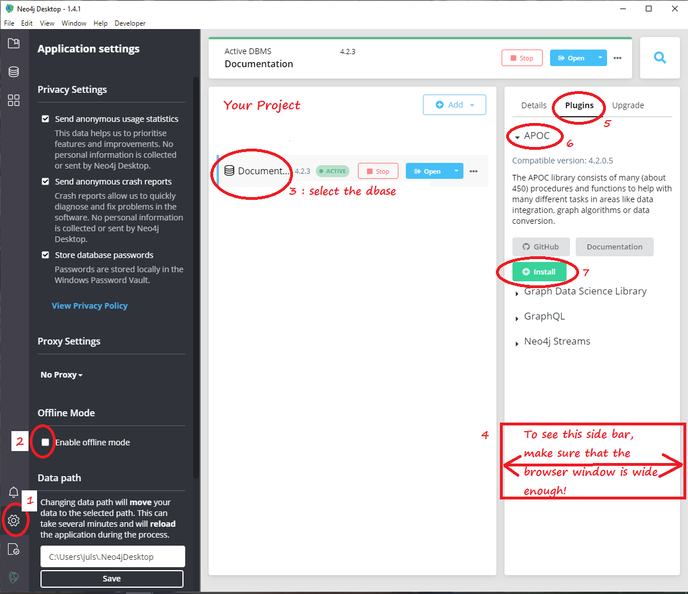

## APPENDIX A - using Neo4j with Docker

A way to run neo4j is to use Docker [(more info)](https://neo4j.com/developer/docker-run-neo4j/)

Here's a full docker run string *with support for apoc and rdf:*

``` 
sudo docker pull neo4

sudo docker run \
--env NEO4J_AUTH=login/password \
--restart always \
--publish=7473:7473 \
--publish=7474:7474 \
--publish=7687:7687 \
--volume=$HOME/neo4j/data:/data \
--volume=$HOME/neo4j/plugins:/plugins \
--volume=$HOME/neo4j/logs:/logs \
--volume=$HOME/neo4j/rdf:/rdf \
--name neo4j \
-e NEO4JLABS_PLUGINS='["apoc", "n10s"]' \
-e NEO4J_dbms_security_procedures_unrestricted=apoc.*,n10s.* \
-e NEO4J_dbms_security_procedures_allowlist=apoc.*,n10s.* \
-e NEO4J_dbms_unmanaged__extension__classes=n10s.endpoint=/rdf \
neo4j &
```


## APPENDIX B - APOC installation with the Neo4j Desktop

