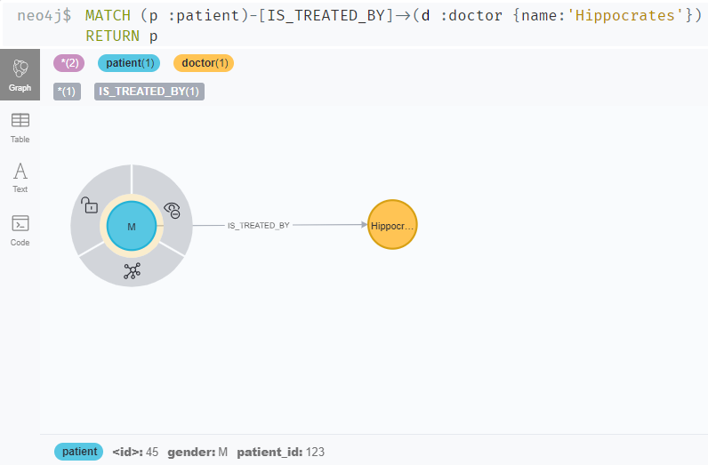

# Neointerface - Neo4j made easy for Python programmers!

A Python interface to use the Neo4j graph database, and simplify its use.

class **NeoInterface**:

    Class to interact programmatically with Neo4j using Python.
    It provides a higher-level wrapper around the Neo4j python connectivity library "Neo4j Python Driver" 
    (https://neo4j.com/docs/api/python-driver/current/api.html)
    
    This class reduces the need to know and use Cypher query language; 
    for a variety of common operations, class methods may be used instead of Cypher queries.
    Advanced users can pass Cypher directly.
 
IMPORTANT NOTE: tested on **versions 4.3.6 and 4.4.11 of Neo4j**

**AUTHORS:**
        Alexey Kuznetsov, Julian West, GlaxoSmithKline

# MICRO-TUTORIAL

## What are Neo4j/Graph Databases, and why do they matter?
If you're new, 
here's a [gentle brief intro](https://julianspolymathexplorations.blogspot.com/2021/02/neo4j-graph-databases-intro.html) 
by one of the authors of this class.

## In a nutshell
If you understand that:
1) Neo4j **nodes** are similar to *records* (rows) in relational databases or spreadsheets
2) Neo4j **node labels** vaguely correspond to table names (though a node can have multiple labels)
3) Neo4j **links (relationships)** are ways of pointing from a record to one or more others 
(akin to "foreign keys" or "join tables" in relational databases)
4) Neo4j includes a **query language named Cypher**, akin to SQL (but much more powerful!) 

then you're ready to start!

## How to set up Neo4j
For use within a company, consult on which method is preferred with your IT department.

*Any one of the following methods:*

* **Super-simple method for beginners**: get a [free account
at the Neo4j sandbox](https://neo4j.com/sandbox/); then use the credentials from that site
* Create or obtain a Docker container with Neo4j : see [appendix A](Appendixes.md)
* Install the free [Neo4j Community server](https://neo4j.com/download-center/#community) 
on your computer - Windows10 or Linux. You will 
also need [Java11](https://www.oracle.com/java/technologies/javase-jdk11-downloads.html), if 
don't have it already.
* Install the Windows program [Neo4j Desktop](https://neo4j.com/download-center/#desktop)  (convenient, 
but be aware that you will be aggressively steered towards the Enterprise edition)
* Use a pre-made VM machine image that contains Neo4j, 
for example from the excellent [Bitnami](https://bitnami.com/stack/neo4j)
* Use [Neo4j Aura](https://neo4j.com/cloud/aura/), a managed solution

Note: some functions in this class, such as export_dbase_json(), require that the *APOC* library 
be installed alongside Neo4j - see [appendix B](Appendixes.md); the Docker option has APOC already enabled.
The RDF functionality requires both APOC and n10s installed.


## A quick gallop thru Neo4j
```python
import neointerface
db = neointerface.NeoInterface(host="neo4j://localhost:7687" , credentials=("neo4j", "YOUR_NEO4J_PASSWORD"))

# Create 2 new nodes (records).  The internal Neo4j node ID is returned
node1_id = db.create_node_by_label_and_dict("patient", {'patient_id': 123, 'gender': 'M'})
node2_id = db.create_node_by_label_and_dict("doctor", {'doctor_id': 1, 'name': 'Hippocrates'})

# You can think of the above as a 1-record table of patients and a 1-record table of doctors.
# Now link the patient to his doctor
db.link_nodes_by_ids(node1_id, node2_id, "IS_TREATED_BY", {'since': 2021})

# You can run general Cypher queries, or use existing methods that allow you to avoid
# them for common operations

# EXAMPLE: find all the patients of a doctor named 'Hippocrates'
cypher = "MATCH (p :patient)-[IS_TREATED_BY]->(d :doctor {name:'Hippocrates'}) RETURN p"
result = db.query(cypher)
print(result)   # SHOWS:  [{'p': {'gender': 'M', 'patient_id': 123}}]
```
The database constructed so far, as seen in the Neo4j [browser](https://browser.neo4j.io/):


## From Pandas dataframe to Neo4j and back
Let's say that you have a Pandas dataframe such as:
```python
import pandas as pd
df_original = pd.DataFrame({"patient_id": [100, 200], "name": ["Jack", "Jill"]})
```


(row number) | patient_id | name
-----| ---------| -------
0| 100 | Jack
1| 200 | Jill

Load it into the Neo4j database simply with:
```python
db.load_df(df_original, "my_label")
```

where *db* is the instantiated NeoInterface class from the earlier example.  The *"my_label"* string
roughly corresponds to table names in relational databases.
Voila', now you have 2 nodes in your database:
>**NODE 1**, with properties "patient_id"=100 and "name"="Jack"
> 
>**NODE 2**, with properties "patient_id"=200 and "name"="Jill"

If you want them back as a dataframe, just do:
```python
df_new = db.get_df("my_label")
```


# Instantiating the Class


## NeoInterface()
name | arguments| return
-----| ---------| -------
*NeoInterface*| host=os.environ.get("NEO4J_HOST"), credentials=(os.environ.get("NEO4J_USER"), os.environ.get("NEO4J_PASSWORD")), apoc=False, rdf=False, rdf_host = None, verbose=True, debug=False, autoconnect=True|

    If unable to create a Neo4j driver object, raise an Exception reminding the user to check whether the Neo4j database is running

    :param host:        URL to connect to database with.  DEFAULT: read from NEO4J_HOST environmental variable
    :param credentials: Pair of strings (tuple or list) containing, respectively, the database username and password
                        DEFAULT: read from NEO4J_USER and NEO4J_PASSWORD environmental variables
                        if None then no authentication is used
    :param apoc:        Flag indicating whether apoc library is used on Neo4j database to connect to
    :param verbose:     Flag indicating whether a verbose mode is to be used by all methods of this class
    :param debug:       Flag indicating whether a debug mode is to be used by all methods of this class
    :param autoconnect  Flag indicating whether the class should establish connection to database at initialization


--- 

# Mini-UI
A mini user interface over some of the NeoInterface functionality is included in this repository. Simply set you environment variables to connect to Neo4j(NEO4J_HOST, NEO4J_USER and NEO4J_PASSWORD) and run 
```source app.sh```
on Unix.


# GENERAL METHODS


## version()
name | arguments| return
-----| ---------| -------
*version*| | str

    Return the version of the Neo4j driver being used. EXAMPLE: '4.2.1'


---


## close()
name | arguments| return
-----| ---------| -------
*close*| | str

    Terminate the database connection.

    Note: this method is automatically invoked after the last operation of a 'with' statement


---


# METHODS TO RUN GENERIC QUERIES


## query()
name | arguments| return
-----| ---------| -------
*query*| q: str, params = None, return_type = 'data'| list/neo4j.Result/pd.DataFrame/MultiDiGraph

        Runs a general Cypher query
        :param q:       A Cypher query
        :param params:  An optional Cypher dictionary
                        EXAMPLE, assuming that the cypher string contains the substrings "$node_id":
                                {'node_id': 20}
        :param return_type: type of the returned result 'data'/'neo4j.Result'/'pd'/'nx'
        *** When return_type == 'neo4j.Result':
        Returns result of the query as a raw neo4j.Result object
        (See https://neo4j.com/docs/api/python-driver/current/api.html#neo4j.Result)
        *** When return_type == 'data' (default):
        Returns a list of dictionaries.
        In cases of error, return an empty list.
        A new session to the database driver is started, and then immediately terminated after running the query.
        :return:        A (possibly empty) list of dictionaries.  Each dictionary in the list
                                will depend on the nature of the Cypher query.
                        EXAMPLES:
                            Cypher returns nodes (after finding or creating them): RETURN n1, n2
                                    -> list item such as {'n1': {'gender': 'M', 'patient_id': 123}
                                                          'n2': {'gender': 'F', 'patient_id': 444}}
                            Cypher returns attribute values that get renamed: RETURN n.gender AS client_gender, n.pid AS client_id
                                    -> list items such as {'client_gender': 'M', 'client_id': 123}
                            Cypher returns attribute values without renaming: RETURN n.gender, n.pid
                                    -> list items such as {'n.gender': 'M', 'n.pid': 123}
                            Cypher returns a single computed value
                                    -> a single list item such as {"count(n)": 100}
                            Cypher returns a single relationship, with or without attributes: MERGE (c)-[r:PAID_BY]->(p)
                                    -> a single list item such as [{ 'r': ({}, 'PAID_BY', {}) }]
                            Cypher creates nodes (without returning them)
                                    -> empty list
        *** When return_type == 'pd':
        Returns result of the query as a pandas dataframe
        (See https://pandas.pydata.org/docs/reference/api/pandas.DataFrame.html)
        by storing the values of node properties in columns of the dataframe
        (note the info about the labels of the nodes is not persisted)
        *** When return_type == 'nx':
        Returns result of the query as a networkx graph
        (See https://networkx.org/documentation/stable/reference/classes/multidigraph.html)
        
        
---


## query_expanded()
name | arguments| return
-----| ---------| -------
*query_expanded*| q: str, params = None, flatten = False| []

    Expanded version of query(), meant to extract additional info for queries that return Graph Data Types,
    i.e. nodes, relationships or paths,
    such as "MATCH (n) RETURN n", or "MATCH (n1)-[r]->(n2) RETURN r"

    For example, if nodes were returned, and their Neo4j internal IDs and/or labels are desired
    (in addition to all the properties and their values)

    Unless the flatten flag is True, individual records are kept as separate lists.
        For example, "MATCH (b:boat), (c:car) RETURN b, c"
        will return a structure such as [ [b1, c1] , [b2, c2] ]  if flatten is False,
        vs.  [b1, c1, b2, c2]  if  flatten is True.  (Note: each b1, c1, etc, is a dictionary.)

    :param q:       A Cypher query
    :param params:  An optional Cypher dictionary
                        EXAMPLE, assuming that the cypher string contains the substring "$age":
                                    {'age': 20}
    :param flatten: Flag indicating whether the Graph Data Types need to remain clustered by record,
                    or all placed in a single flattened list.

    :return:        A (possibly empty) list of dictionaries, which will depend on which Graph Data Types
                                were returned in the Cypher query.
                                EXAMPLE - for a returned node
                                    {'gender': 'M', 'age': 20, 'neo4j_id': 123, 'neo4j_labels': ['patient']}
                                EXAMPLE - for a returned relationship
                                    {'price': 7500, 'neo4j_id': 2,
                                     'neo4j_start_node': <Node id=11 labels=frozenset() properties={}>,
                                     'neo4j_end_node': <Node id=14 labels=frozenset() properties={}>,
                                     'neo4j_type': 'bought_by'}]


---


# METHODS TO RETRIEVE DATA


## get_single_field()
name | arguments| return
-----| ---------| -------
*get_single_field*| labels, field_name: str, properties_condition=None, cypher_clause=None, cypher_dict=None| list

    For situations where one is fetching just 1 field,
    and one desires a list of those values, rather than a dictionary of records.
    In other respects, similar to the more general get_nodes()

    EXAMPLES: fetch_single_field("car", "price", properties_condition={"car_make": "Toyota"})
                    will RETURN a list of prices of all the Toyota models
              fetch_single_field("car", "price", properties_condition={"car_make": "Toyota"}, clause="n.price < 50000")
                    will RETURN a list of prices of all the Toyota models that cost less than 50000

    :param field_name:  A string with the name of the desired field (attribute)

    For more information on the other parameters, see get_nodes()

    :return:  A list of the values of the field_name attribute in the nodes that match the specified conditions


---


## get_nodes()
name | arguments| return
-----| ---------| -------
*get_nodes*| labels="", properties_condition=None, cypher_clause=None, cypher_dict=None, return_nodeid=False, return_labels=False| [{}]

    EXAMPLES:
        get_nodes("")       # Get ALL nodes
        get_nodes("client")
        get_nodes("client", properties_condition = {"gender": "M", "ethnicity": "white"})
        get_nodes("client", cypher_clause = "n.age > 40 OR n.income < 50000")
        get_nodes("client", cypher_clause = "n.age > $some_age", cypher_dict = {"$some_age": 40})
        get_nodes("client", properties_condition = {"gender": "M", "ethnicity": "white"} ,
                                       cypher_clause = "n.age > 40 OR n.income < 50000")
    RETURN a list of the records (as dictionaries of ALL the key/value node properties)
    corresponding to all the Neo4j nodes with the specified label,
        AND satisfying the given Cypher CLAUSE (if present),
        AND exactly matching ALL of the specified property key/values pairs  (if present).
        I.e. an implicit AND operation.
    IMPORTANT: nodes referred to in the Cypher clause must be specified as "n."

    A dictionary of data binding (cypher_dict) for the Cypher clause may be optionally specified.
    In case of conflict (any key overlap) between the dictionaries cypher_dict and properties_condition, and Exception is raised.
    Optionally, the Neo4j internal node ID and label name(s) may also be obtained and returned.

    :param labels:          A string (or list/tuple of strings) specifying one or more Neo4j labels;
                                an empty string indicates that the match is to be carried out
                                across all labels - NOT RECOMMENDED for large databases!
                                (Note: blank spaces ARE allowed in the strings)
    :param cypher_dict:     Dictionary of data binding for the Cypher string.  EXAMPLE: {"gender": "M", "age": 40}
    :param cypher_clause:   String with a clause to refine the search; any nodes it refers to, MUST be specified as "n."
                                EXAMPLE with hardwired values:  "n.age > 40 OR n.income < 50000"
                                EXAMPLE with data-binding:      "n.age > $age OR n.income < $income"
                                        (data-binding values are specified in cypher_dict)
    :param properties_condition: A (possibly-empty) dictionary of property key/values pairs. Example: {"gender": "M", age: 64}
                                 IMPORTANT: cypher_dict and properties_dict must have no overlapping keys, or an Exception will be raised
    :param return_nodeid:   Flag indicating whether to also include the Neo4j internal node ID in the returned data
                                (using "neo4j_id" as its key in the returned dictionary)
    :param return_labels:   Flag indicating whether to also include the Neo4j label names in the returned data
                                (using "neo4j_labels" as its key in the returned dictionary)
    :return:        A list whose entries are dictionaries with each record's information
                    (the node's attribute names are the keys)
                    EXAMPLE: [  {"gender": "M", "age": 42, "condition_id": 3},
                                {"gender": "M", "age": 76, "location": "Berkeley"}
                             ]
                    Note that ALL the attributes of each node are returned - and that they may vary across records.
                    If the flag return_nodeid is set to True, then an extra key/value pair is included in the dictionaries,
                            of the form     "neo4j_id": some integer with the Neo4j internal node ID
                    If the flag return_labels is set to True, then an extra key/value pair is included in the dictionaries,
                            of the form     "neo4j_labels": [list of Neo4j label(s) attached to that node]
                    EXAMPLE using both of the above flags:
                        [  {"neo4j_id": 145, "neo4j_labels": ["person", "client"], "gender": "M", "age": 42, "condition_id": 3},
                           {"neo4j_id": 222, "neo4j_labels": ["person"], "gender": "M", "age": 76, "location": "Berkeley"}
                        ]


---


## get_df()
name | arguments| return
-----| ---------| -------
*get_df*| labels="", properties_condition=None, cypher_clause=None, cypher_dict=None, return_nodeid=False, return_labels=False| pd.DataFrame

    Same as get_nodes(), but the result is returned as a Pandas dataframe

    See get_nodes() for more information


---


## get_parents_and_children()
name | arguments| return
-----| ---------| -------
*get_parents_and_children*| node_id: int| {}

    Fetch all the nodes connected to the given one by INbound relationships to it (its "parents"),
    as well as by OUTbound relationships to it (its "children")
    :param node_id: An integer with a Neo4j internal node ID
    :return:        A dictionary with 2 keys: 'parent_list' and 'child_list'
                    The values are lists of dictionaries with 3 keys: "id", "label", "rel"
                        EXAMPLE of individual items in either parent_list or child_list:
                        {'id': 163, 'labels': ['Subject'], 'rel': 'HAS_TREATMENT'}


---


## get_labels()
name | arguments| return
-----| ---------| -------
*get_labels*| | [str]

    Extract and return a list of all the Neo4j labels present in the database.
    No particular order should be expected.

    :return:    A list of strings


---


## get_relationshipTypes()
name | arguments| return
-----| ---------| -------
*get_relationshipTypes*| | [str]

    Extract and return a list of all the Neo4j relationship types present in the database.
    No particular order should be expected.
    
    :return:    A list of strings

---


## get_label_properties()
name | arguments| return
-----| ---------| -------
*get_label_properties*| label:str| list

    Return a list of keys associated to any node with the given label


---


# METHODS TO GET/CREATE/MODIFY SCHEMA


## get_indexes()
name | arguments| return
-----| ---------| -------
*get_indexes*| types=None| pd.DataFrame

    Return all the database indexes, and some of their attributes,
    as a Pandas dataframe.
    Optionally restrict the type (such as "BTREE") of indexes returned.

    EXAMPLE:
           labelsOrTypes            name          properties   type uniqueness
         0    [my_label]  index_23b0962b       [my_property]  BTREE  NONUNIQUE
         1    [my_label]       some_name  [another_property]  BTREE     UNIQUE

    :param types:   Optional list to of types to limit the result to
    :return:        A (possibly-empty) Pandas dataframe


---


## get_constraints()
name | arguments| return
-----| ---------| -------
*get_constraints*| | pd.DataFrame

    Return all the database constraints, and some of their attributes,
    as a Pandas dataframe with 3 columns:
        name        EXAMPLE: "my_constraint"
        description EXAMPLE: "CONSTRAINT ON ( patient:patient ) ASSERT (patient.patient_id) IS UNIQUE"
        details     EXAMPLE: "Constraint( id=3, name='my_constraint', type='UNIQUENESS',
                              schema=(:patient {patient_id}), ownedIndex=12 )"

    :return:  A (possibly-empty) Pandas dataframe


---


## create_index()
name | arguments| return
-----| ---------| -------
*create_index*| label: str, key: str| bool

    Create a new database index, unless it already exists,
    to be applied to the specified label and key (property).
    The standard name given to the new index is of the form label.key

    EXAMPLE - to index nodes labeled "car" by their key "color":
                    create_index("car", "color")
              This new index - if not already in existence - will be named "car.color"

    If an existing index entry contains a list of labels (or types) such as ["l1", "l2"] ,
    and a list of properties such as ["p1", "p2"] ,
    then the given pair (label, key) is checked against ("l1_l2", "p1_p2"), to decide whether it already exists.

    :param label:   A string with the node label to which the index is to be applied
    :param key:     A string with the key (property) name to which the index is to be applied
    :return:        True if a new index was created, or False otherwise


---


## create_constraint()
name | arguments| return
-----| ---------| -------
*create_constraint*| label: str, key: str, type="UNIQUE", name=None| bool

    Create a uniqueness constraint for a node property in the graph,
    unless a constraint with the standard name of the form `{label}.{key}.{type}` is already present

    Note: it also creates an index, and cannot be applied if an index already exists.

    EXAMPLE: create_constraint("patient", "patient_id")

    :param label:   A string with the node label to which the constraint is to be applied
    :param key:     A string with the key (property) name to which the constraint is to be applied
    :param type:    For now, the default "UNIQUE" is the only allowed option
    :param name:    Optional name to give to the new constraint; if not provided, a
                        standard name of the form `{label}.{key}.{type}` is used.  EXAMPLE: "patient.patient_id.UNIQUE"
    :return:        True if a new constraint was created, or False otherwise


---


## drop_index()
name | arguments| return
-----| ---------| -------
*drop_index*| name: str| bool

    Eliminate the index with the specified name.

    :param name:    Name of the index to eliminate
    :return:        True if successful or False otherwise (for example, if the index doesn't exist)


---


## drop_constraint()
name | arguments| return
-----| ---------| -------
*drop_constraint*| name: str| bool

    Eliminate the constraint with the specified name.

    :param name:    Name of the constraint to eliminate
    :return:        True if successful or False otherwise (for example, if the constraint doesn't exist)


---


## drop_all_constraints()
name | arguments| return
-----| ---------| -------
*drop_all_constraints*| | None

    Eliminate all the constraints in the database

    :return:    None


---


## drop_all_indexes()
name | arguments| return
-----| ---------| -------
*drop_all_indexes*| including_constraints=True| None

    Eliminate all the indexes in the database and, optionally, also get rid of all constraints

    :param including_constraints:   Flag indicating whether to also ditch all the constraints
    :return:                        None


---


# METHODS TO CREATE/MODIFY DATA


## create_node_by_label_and_dict()
name | arguments| return
-----| ---------| -------
*create_node_by_label_and_dict*| label: str, items=None| int

    Create a new node with the given label and with the attributes/values specified in the items dictionary
    Return the Neo4j internal ID of the node just created.

    :param label:   A string with a Neo4j label (ok to include blank spaces)
    :param items:   An optional dictionary.  EXAMPLE: {'age': 22, 'gender': 'F'}    
    :return:        An integer with the Neo4j internal ID of the node just created


---


## delete_nodes_by_label()
name | arguments| return
-----| ---------| -------
*delete_nodes_by_label*| delete_labels=None, keep_labels=None, batch_size = 50000| None

    Empty out (by default completely) the Neo4j database.
    Optionally, only delete nodes with the specified labels, or only keep nodes with the given labels.
    Note: the keep_labels list has higher priority; if a label occurs in both lists, it will be kept.
    IMPORTANT: it does NOT clear indexes; "ghost" labels may remain!  To get rid of those, run drop_all_indexes()

    :param delete_labels:   An optional string, or list of strings, indicating specific labels to DELETE
    :param keep_labels:     An optional string or list of strings, indicating specific labels to KEEP
                                (keep_labels has higher priority over delete_labels)
    :return:                None


---


## clean_slate()
name | arguments| return
-----| ---------| -------
*clean_slate*| keep_labels=None, drop_indexes=True, drop_constraints=True| None

    Use this to get rid of absolutely everything in the database.
    Optionally, keep nodes with a given label, or keep the indexes, or keep the constraints

    :param keep_labels:     An optional list of strings, indicating specific labels to KEEP
    :param drop_indexes:    Flag indicating whether to also ditch all indexes (by default, True)
    :param drop_constraints:Flag indicating whether to also ditch all constraints (by default, True)
    :return:                None


---

## extract_entities()
name | arguments| return
-----| ---------| -------
*extract_entities*| mode='merge', label=None, cypher=None, cypher_dict=None, target_label=None, property_mapping={}, relationship=None, direction=None| None
                         
    Create new nodes using data from other nodes
        
        Example use:
        df = pd.DataFrame({'id': [1, 2, 3, 4, 5], 'color': ['red', 'red', 'red', 'blue', 'blue']})
        db.load_df(df, label='Thing')
        db.extract_entities(
            label='Thing',
            target_label='Color',
            relationship='OF',
            property_mapping=['color'])
        
        :param mode:str; assert mode in ['merge', 'create']
        :param label:str; label of the nodes to extract data from
        :param cypher: str; only of label not provided: cypher that returns id(node) of the nodes to extract data from
            EXAMPLE:
            cypher = '''
            MATCH (f:`Source Data Table`{{_domain_:$domain}})-[:HAS_DATA]->(node:`Source Data Row`)
            RETURN id(node)
            '''
        :param cypher_dict: None/dict parameters required for the cypher query
            EXAMPLE:
            cypher_dict={'domain':'ADSL'}
        :param target_label: label of the newly created nodes with extracted data
        :param property_mapping: dict or list
            if dict: keys correspond to the property names of source data (e.g. Source Data Row) and values correspond
            to to the property names of the target class where the data is extracted to
            		if list: properties of the extracted node (as per the list) will extracted and will be named same as
            		in the source node
        :param relationship: type of the relationship (to/from the extraction node) to create
        :param direction: direction of the relationship to create (>: to the extraction node, <: from the extraction node)
        :return: None
        
  
The part in green would be created as the result of operation in the "Example use".        
---


# METHODS TO CREATE NEW RELATIONSHIPS

## link_entities()
name | arguments| return
-----| ---------| -------
*link_entities*| left_class:str, right_class:str, relationship="\_default_", cond_via_node=None, cond_left_rel=None, cond_right_rel=None, cond_cypher=None, cond_cypher_dict=None| None

    Creates relationship of type {relationship}
    Example use:
    db.link_entities(left_class='Thing', right_class='Thing',
                cond_via_node="Color",
                cond_left_rel="<OF",
                cond_right_rel="OF>",
                relationship="SAME_COLOR")
                
        :param left_class:      Name of the left class 
        :param right_class:     Name of the right class
        :param relationship:    Name to give the relationship (if None: will use name of right_class (f'HAS_{right_class.upper())')
        :param cond_via_node:   Name of central node from which relationships will be created
        :param cond_left_rel:   Name and direction of relationship from right_class (e.g. FROM_DATA> or <FROM_DATA)
        :param cond_right_rel:  Name and direction of relationship from left_class (e.g. FROM_DATA> or <FROM_DATA)
        :param cond_cypher:     (optional) - if not None: cond_via_node, cond_left_rel, cond_right_rel will be ignored
                                instead the cypher query will be run which return nodes 'left' and 'right' to be linked 
                                with relationship of type {relationship}
        :param cond_cypher_dict: parameters required for the cypher query
        :return: None

  
SAME_COLOR relationships in green would be created as the result of operation in "Example use" 
---

## link_nodes_on_matching_property()
name | arguments| return
-----| ---------| -------
*link_nodes_on_matching_property*| label1:str, label2:str, property1:str, rel:str, property2=None| None

    Locate any pair of Neo4j nodes where all of the following hold:
                        1) the first one has label1
                        2) the second one has label2
                        3) the two nodes agree in the value of property1 (if property2 is None),
                                    or in the values of property1 in the 1st node and property2 in the 2nd node

    For any such pair found, add a relationship - with the name specified in the rel argument - from the 1st to 2nd node,
    unless already present

    :param label1:      A string against which the label of the 1st node must match
    :param label2:      A string against which the label of the 2nd node must match
    :param property1:   Name of property that must be present in the 1st node (and also in 2nd node, if property2 is None)
    :param property2:   Name of property that must be present in the 2nd node (may be None)
    :param rel:         Name to give to all relationships that get created
    :return:            None


---


## link_nodes_on_matching_property_value()
name | arguments| return
-----| ---------| -------
*link_nodes_on_matching_property_value*| label1:str, label2:str, prop_name:str, prop_value:str, rel:str| None

    Locate any pair of Neo4j nodes where all of the following hold:
                        1) the first one has label1
                        2) the second one has label2
                        3) both nodes have a property with the specified name
                        4) the string values of the properties in (3) in the two nodes are both equal to the specified value
    For any such pair found, add a relationship - with the name specified in the rel argument - from the 1st to 2nd node,
    unless already present

    :param label1:      A string against which the label of the 1st node must match
    :param label2:      A string against which the label of the 2nd node must match
    :param prop_name:   Name of property that must be present in both nodes
    :param prop_value:  A STRING value that the above property must have in both nodes
    :param rel:         Name to give to all relationships that get created
    :return:            None


---


## link_nodes_by_ids()
name | arguments| return
-----| ---------| -------
*link_nodes_by_ids*| node_id1:int, node_id2:int, rel:str, rel_props = None| None

    Locate the pair of Neo4j nodes with the given Neo4j internal ID's.
    If they are found, add a relationship - with the name specified in the rel argument,
    and with the specified optional properties - from the 1st to 2nd node, unless already present

    :param node_id1:    An integer with the Neo4j internal ID to locate the 1st node
    :param node_id2:    An integer with the Neo4j internal ID to locate the 2nd node
    :param rel:         A string specifying a Neo4j relationship name
    :param rel_props:   Optional dictionary with the relationship properties.  EXAMPLE: {'since': 2003, 'code': 'xyz'}
    :return:         None


---


# METHODS TO READ IN DATA


## load_df()
name | arguments| return
-----| ---------| -------
*load_df*| df:pd.DataFrame, label:str, merge=True, primary_key=None, rename=None, max_chunk_size = 10000| None

    Load a Pandas data frame into Neo4j.
    Each line is loaded as a separate node.

    :param df:              A Pandas data frame to import into Neo4j
    :param label:           String with Neo4j label to use on the newly-created nodes
    :param merge:           If true, records are "merged" (added only if not present); otherwise, always added
    :param primary_key:     Only applicable when merging
    :param rename:          Optional dictionary to rename columns
    :param max_chunk_size:  To limit the number of rows loaded at one time
    :return:                None

## load_dict()
name | arguments| return
-----| ---------| -------
*load_dict*| dct:dict, label="Root", rel_prefix="", maxdepth=10| None

    Loads python dict to Neo4j (auto-unpacking hierarchy)
    
    Children of type dict converted into related nodes with relationship {rel_prefix}_{key}
    Children of type list (of dict or other) converted into:
        - multiple related nodes for list items of type dict
        - properties of parent node of type list in case list items        
    see example in tests.test_json.test_import_custom_json
    
    :param dct: python dict to load
    :param label: label to assign to the root node
    :param rel_prefix: prefix to add to relationship name from parent to child
    :param maxdepth: maximum possible depth(of children) of dict
    :return: None


## load_arrows_dict()
name | arguments| return
-----| ---------| -------
*load_arrows_dict*| dct: dict, merge_on = None| result of the corresponding Neo4j query: {'node_map':dict, 'rel_map':dict}

    Loads data created in prototyping tool https://arrows.app/
    Uses MERGE statement separately on each node and each relationship using all properties as identifying properties
    Example of use:
    with open("arrows.json", 'r') as jsonfile:
        dct = json.load(jsonfile)
    neo = NeoInterface()
    neo.load_arrows_dict(dct)

    :param dct: python dict to load
    :param merge_on: None or dict with label as key and list of properties as value - the properties will be used
        as identProps in apoc.merge.node, the rest of the properties will be used as onCreateProps and onMatchProps
    :return: result of the corresponding Neo4j query

---


# UTILITY METHODS


## dict_to_cypher()
name | arguments| return
-----| ---------| -------
*dict_to_cypher*| data_dict: {}| (str, {})

    Turn a Python dictionary (meant for specifying node or relationship attributes)
    into a string suitable for Cypher queries,
    plus its corresponding data-binding dictionary.

    EXAMPLE :
                {'cost': 65.99, 'item description': 'the "red" button'}
            will lead to
                (
                    '{`cost`: $par_1, `item description`: $par_2}',
                    {'par_1': 65.99, 'par_2': 'the "red" button'}
                )

    Note that backticks are used in the Cypher string to allow blanks in the key names.
    Consecutively-named dummy variables ($par_1, $par_2, etc) are used,
    instead of names based on the keys of the data dictionary (such as $cost),
    because the keys might contain blanks.

    :param data_dict:   A Python dictionary
    :return:            A pair consisting of a string suitable for Cypher queries,
                            and a corresponding data-binding dictionary.
                        If the passed dictionary is empty or None,
                            the pair returned is ("", {})


---


# METHODS TO SUPPORT DEBUGGING


## neo4j_query_params_from_dict()
name | arguments| return
-----| ---------| -------
*neo4j_query_params_from_dict*| params:dict, char_limit = 500| str

    :param params: query parameters in a form of python dict
    :param char_limit: limit number of characters to print
    :return: string of parameters to paste into Neo4j browser for testing procedures in the browser


---


# METHODS TO SUPPORT JSON IMPORT/EXPORT


## export_dbase_json()
name | arguments| return
-----| ---------| -------
*export_dbase_json*| | {}

    Export the entire Neo4j database as a JSON string
    EXAMPLE:
    { 'nodes': 2,
      'relationships': 1,
      'properties': 6,
      'data': '[{"type":"node","id":"3","labels":["User"],"properties":{"name":"Adam","age":32,"male":true}},\n
                {"type":"node","id":"4","labels":["User"],"properties":{"name":"Eve","age":18}},\n
                {"id":"1","type":"relationship","label":"KNOWS","properties":{"since":2003},"start":{"id":"3","labels":["User"]},"end":{"id":"4","labels":["User"]}}\n
               ]'
    }
    NOTE - the Neo4j Browser uses a slightly different format for NODES:
            {
              "identity": 4,
              "labels": [
                "User"
              ],
              "properties": {
                "name": "Eve",
                "age": 18
              }
            }
          and a substantially more different format for RELATIONSHIPS:
            {
              "identity": 1,
              "start": 3,
              "end": 4,
              "type": "KNOWS",
              "properties": {
                "since": 2003
              }
            }

    IMPORTANT - this function requires that the APOC library be installed alongside Neo4j
    
    :return:    A dictionary specifying the number of nodes exported,
                the number of relationships, and the number of properties,
                as well as a "data" field with the actual export in JSON format


---


## import_json_data()
name | arguments| return
-----| ---------| -------
*import_json_data*| json_str: str|

    Import nodes and/or relationships into the database, as directed by the given data dump in JSON form.
    Note: the id's of the nodes need to be shifted,
          because one cannot force the Neo4j internal id's to be any particular value...
          and, besides (if one is importing into an existing database), particular id's may already be taken.

    :param json_str:    A JSON string with the format specified under export_dbase_json()
    :return:            A status message with import details if successful, or an Exception if not


---


# METHODS TO SUPPORT RDF PROCEDURES


## rdf_generate_uri()
name | arguments| return
-----| ---------| -------
*rdf_generate_uri*| dct={}, include_label_in_uri=True, prefix='neo4j://graph.schema#', add_prefixes=[], sep = '/', uri_prop = 'uri'| None

    A method that
        - on the neo4j nodes with labels equal to keys of :dict dictionary
        - sets additional label Resource (for handling in RDF)
        - sets property with name :uri_prop with value that starts with prefix folled by a string
        built by concatenating with separator :sep the list of :add_prefixes together with values of
        properties on each node that are specified in the values of the :dict (different set for each Neo4j label)
    Used for the purpose of being able to save and restore subgraphs using methods rdf_get_subgraph and
    rdf_import_subgraph_inline.
    :param dct: dictionary describing set of node properties that construct a primary key (and eventually uri) for that node
    EXAMPLE:
    dct = {
        'Vehicle': ['type', 'model'],
        'Car': ['model', 'fuel']
    }
    generate_uri(dct)
    will set property uri like 'neo4j://graph.schema#car/toyota' on nodes with labels Vehicle
    (in case v.type == 'car' and v.model == 'toyota')
    and set property uri like 'neo4j://graph.schema#toyota/petrol' on nodes with labels Car
    (in case c.model == 'toyota' and v.fuel == 'petrol')

    :param prefix: a prefix for uri
    :param add_prefixes: list of prefixes to prepend uri with (after prefix), list joined with :sep separator
    :param sep: separator for joining add_perfixes and the primary keys into uri
    :return: None


---


## rdf_get_subgraph()
name | arguments| return
-----| ---------| -------
*rdf_get_subgraph*| cypher:str, cypher_dict={}, format="Turtle"| str

    A method that returns an RDF serialization of a subgraph specified by :cypher query
    LIMITATION: properties on Relationship are not saved!

    :param cypher: cypher query to return a subgraph
    :param cypher_dict: parameters required for the cypher query
    :param format: RDF format in which to serialize output
    :return: str - RDF serialization of subgraph


---


## rdf_import_fetch()
name | arguments| return
-----| ---------| -------
*rdf_import_fetch*| url: str, format="Turtle"|

---


## rdf_import_subgraph_inline()
name | arguments| return
-----| ---------| -------
*rdf_import_subgraph_inline*| rdf:str, format="Turtle"|

    A method that creates/merges appropriate nodes in Neo4j as specified in the provided :rdf string
    The nodes will be MERGEd by 'uri' property

    :param rdf: RDF serialization of Neo4j nodes and relationships
    :param format: RDF serialization format
    :return: returns a dictionary with keys triplesParsed, triplesLoaded as a summary of the operation


---


## rdf_get_graph_onto()
name | arguments| return
-----| ---------| -------
*rdf_get_graph_onto*| |

    A method that returns an ontology autogenerated from existing nodes in Neo4j (provided by n10s(neosemantics) library

    :return: str - serialized ontology
